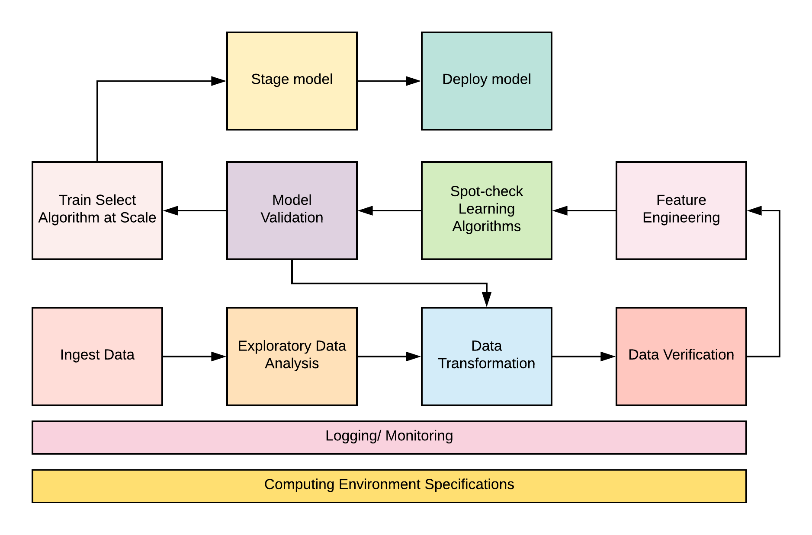
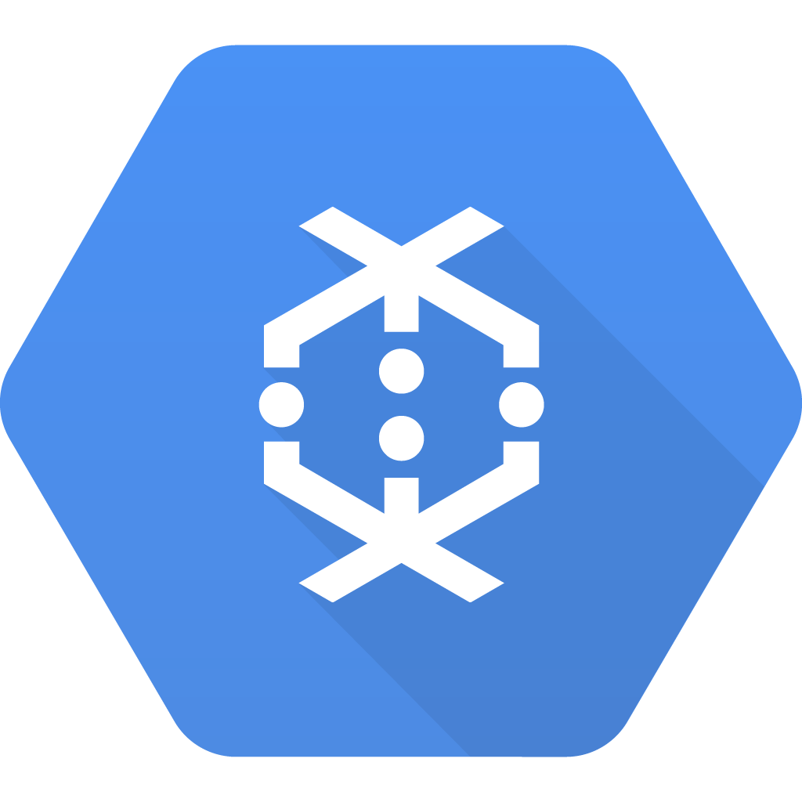
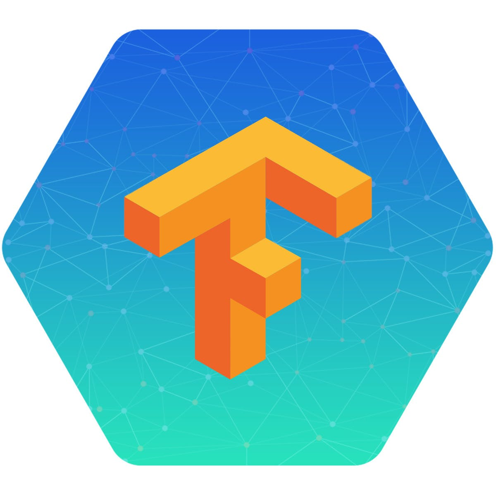

# Introduction

Machine learning is often and rightly viewed as the use of mathematical algorithms to teach the computer to learn tasks that are computationally infeasible to program as a set of specified instructions. However, the use of these algorithms happen to constitute only a tiny fraction of the overall learning pipeline from an Engineering perspective. Building high-performant and dynamic learning models includes a number of other critical components. These components actually dominate the space of concerns for delivering an end-to-end machine learning product.

A typical machine learning production pipeline looks like the illustration below.

From the above diagram, observe that the process flow in the pipeline is iterative. This repetitive pattern is central to machine learning experimentation, design and deployment.

## The Efficiency Challenge
It is easy to recognize that the pipeline requires a significant amount of development operations for the seamless transition from one component to another when building a learning model. This interoperability of parts has given rise to Machine Learning Ops, also know as MLOps. The term is coined as an amalgam of Machine Learning and DevOps.

The conventional way of doing machine learning is to perform all of the experiment and development work in Jupyter notebooks and the model is exported and sent off to the software development team for deployment and endpoint generation for integration into downstream software products while the DevOps team handles the infrastructure and configuration of the machine for model development. This monolithic style of working results in a machine learning process that is not re-usable, difficult to scale and maintain, even tougher to audit and perform model improvement and it is easily fraught with errors and unnecessary complexities.

However, by incorporating the microservices design pattern to machine learning development, we can address a host of these concerns and really streamline the productionalization process.

## A Word on Google Cloud Platform (GCP)
The tutorial will focus on developing and deploying production models on Google Cloud Platforms' infrastructure. The advantage of the cloud is the ease of distributing and scaling out individual workflow components depending on resource demands. However, when working with microservices, the containerized pipeline is machine agnostic and can quickly be deployed on any other on-prem infrastructure or public cloud service providers such as AWS or Azure.

Google Cloud Platform has a powerful array of AI serverless services that we will incorporate to handle some components of the production pipeline. These services include Google BigQuery for staging our transformed dataset for easy analytics, Google Dataflow for large-scale data transformation, and Google Cloud Machine Learning Engine for large-scale model training and model deployment.

    &nbsp;&nbsp;&nbsp;&nbsp;&nbsp;&nbsp;&nbsp;&nbsp;&nbsp;
    &nbsp;&nbsp;&nbsp;&nbsp;&nbsp;&nbsp;&nbsp;&nbsp;&nbsp;
    &nbsp;&nbsp;&nbsp;&nbsp;&nbsp;&nbsp;&nbsp;&nbsp;&nbsp;
    

