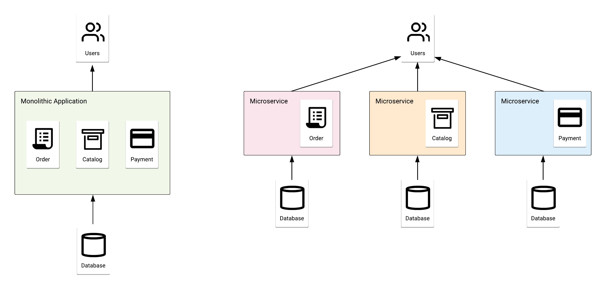

# Microservies Architecture

The Microservice architecture is an approach for developing and deploying enterprise software applications that involve separating the core business capabilities of the application into decoupled components. Each business capability represents some functionality that the application provides as services to the end-user. The idea of Microservices is in contrast to the Monolithic architecture which involves building applications as a composite of its "individual" capabilities.

Microservices communicate with each other using properly defined stateless APIs such as REST (Representational state transfer). By stateless, we mean that <a href="https://stackoverflow.com/a/3105337/3353760">"the server does not store state about the client session"</a>. This flexibility allows the microservice to easily scale and respond to request even if another microservice fails.

## Advantages of Microservices
- Loosely coupled components makes the application fault tolerant.
- Ability to scale-out making each component highly-available.