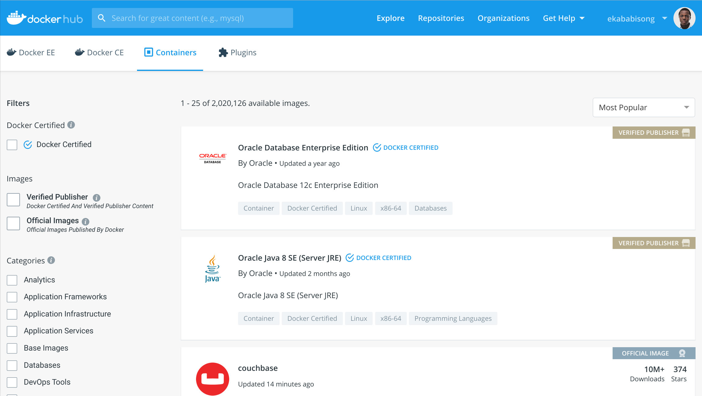
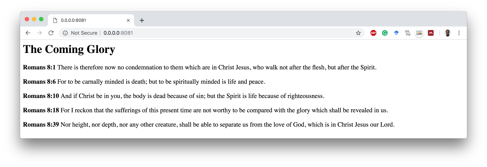

# Docker

Table of Contents:
- [Docker](#docker)
  - [Virtual Machines vs. Containers](#virtual-machines-vs-containers)
  - [Working with Docker](#working-with-docker)
  - [Introducing DockerHub](#introducing-dockerhub)
  - [Key Routines when Writing a Dockerfile](#key-routines-when-writing-a-dockerfile)
  - [Build and Run a Simple Docker Container](#build-and-run-a-simple-docker-container)
    - [Build the Image](#build-the-image)
    - [Run the Container](#run-the-container)
  - [Important Docker Commands](#important-docker-commands)
    - [Commands for Managing Images](#commands-for-managing-images)
    - [Commands for Managing Containers](#commands-for-managing-containers)
    - [Running a Docker Container](#running-a-docker-container)
  - [Serve a Webpage on an `nginx` Web Server with Docker](#serve-a-webpage-on-an-nginx-web-server-with-docker)
    - [The Dockerfile](#the-dockerfile)
    - [Build the image](#build-the-image)
    - [Run the container](#run-the-container)
    - [View Webpage on the Running Server](#view-webpage-on-the-running-server)

Docker is a virtualization application that abstracts applications into isolated environments known as *containers*. The idea behind a container is to provide a unified platform that includes the software tools and dependencies for developing and deploying an application.

The traditional way of developing applications is where an application is designed and hosted on a single server. This setup results in a number of problems including the famous "it works on my machine but not on yours". Also in this architecture, apps are difficult to scale and to migrate resulting in huge costs and slow deployment.


## Virtual Machines vs. Containers
Virtual machines (VMs) emulates the capabilities of a physical machine making it possible to install and run operating systems by using a hypervisor. The hypervisor is a piece of software on the physical machine (the host) that makes it possible to carry out virtualization where multiple guest machines are managed by the host machine.


Containers on the other hand isolate the environment for hosting an application with its own libraries and software dependencies, however, as opposed to a VM, containers on a machine all share the same operating system kernel. Docker is an example of a container.


## Working with Docker
Begin by installing Docker software on the local machine to enable it run Docker containers. Visit <a href="https://www.docker.com/get-started">https://www.docker.com/get-started</a> to get started.

Key concepts to note are:
- **Dockerfile:** A Dockerfile is a text file that specifies how an image will be created.
- **Docker Images:** Images are created by building a Dockerfile.
- **Docker Containers:** Docker containers is the runnning instance of an image.

The diagram below highlights the process to build an image and run a Docker container.


## Introducing DockerHub
DockerHub is a library for hosting Docker images.


## Key Routines when Writing a Dockerfile
The following are key routines when creating a Dockerfile.

|**Command**|**Description**|
|-|-|
|__FROM__| The base Docker image for the Dockerfile.
|__LABEL__| Key-value pair for specifying image metadata.
|__RUN__| It execute commands on top of the current image as new layers.
|__COPY__| Copies files from the local machine to the container filesystem.
|__EXPOSE__ | Exposes runtime ports for the Docker container.
|__CMD__ | Specifies the command to execute when running the container. This command is overridden if another command is specified at runtime.
|__ENTRYPOINT__ | Specifies the command to execute when running the container. Entrypoint commands are not overridden by a command specified at runtime.
|__WORKDIR__ | Set working directory of the container.
|__VOLUME__ | Mount a volume from the local machine filesystem to the Docker container.
|__ARG__ | Set Environment variable as a key-value pair when building the image.
|__ENV__ | Set Environment variable as a key-value pair that will be available in the container after building.

## Build and Run a Simple Docker Container
In this simple example, we have a bash script titled `date-script.sh`. The script assigns the current date to a variable and then prints out the date to the console. The Dockerfile will copy the script from the local machine to the docker container filesystem and execute the shell script when running the container. The Dockerfile to build the container is stored in `docker-intro/hello-world`.

```bash
# navigate to folder with images
cd docker-intro/hello-world
```
Let's view the bash script.
```bash
cat date-script.sh
```

```bash
#! /bin/sh
DATE="$(date)"
echo "Todays date is $DATE"
```

Let's view the Dockerfile.
```bash
# view the Dockerfile
cat Dockerfile
```

```bash
# base image for building container
FROM docker.io/alpine
# add maintainer label
LABEL maintainer="dvdbisong@gmail.com"
# copy script from local machine to container filesystem
COPY date-script.sh /date-script.sh
# execute script
CMD sh date-script.sh
```

- The Docker image will be built-off the Alpine linux package. See <a href="https://hub.docker.com/_/alpine">https://hub.docker.com/_/alpine</a>
- The `CMD` routine executes the script when the container runs.

### Build the Image
```bash
# build the image
docker build -t ekababisong.org/first_image .
```

Build output:
```
Sending build context to Docker daemon  2.048kB
Step 1/4 : FROM docker.io/alpine
latest: Pulling from library/alpine
6c40cc604d8e: Pull complete 
Digest: sha256:b3dbf31b77fd99d9c08f780ce6f5282aba076d70a513a8be859d8d3a4d0c92b8
Status: Downloaded newer image for alpine:latest
 ---> caf27325b298
Step 2/4 : LABEL maintainer="dvdbisong@gmail.com"
 ---> Running in 306600656ab4
Removing intermediate container 306600656ab4
 ---> 33beb1ebcb3c
Step 3/4 : COPY date-script.sh /date-script.sh
 ---> Running in 688dc55c502a
Removing intermediate container 688dc55c502a
 ---> dfd6517a0635
Step 4/4 : CMD sh date-script.sh
 ---> Running in eb80136161fe
Removing intermediate container eb80136161fe
 ---> e97c75dcc5ba
Successfully built e97c75dcc5ba
Successfully tagged ekababisong.org/first_image:latest
```

### Run the Container
```bash
# show the images on the image
docker images
```

```
REPOSITORY                    TAG                 IMAGE ID            CREATED             SIZE
ekababisong.org/first_image   latest              e97c75dcc5ba        32 minutes ago      5.52MB
alpine                        latest              caf27325b298        3 weeks ago         5.52MB
```

```bash
# run the docker container from the image
docker run ekababisong.org/first_image
```

```
Todays date is Sun Feb 24 04:45:08 UTC 2019
```

## Important Docker Commands
### Commands for Managing Images
|**Command**|**Description**|
|-|-|
|`docker images`| List all images on the machine.
|`docker rmi [IMAGE_NAME]`| Remove the image with name `IMAGE_NAME` on the machine.
|`docker rmi $(docker images -q)`| Remove all images from the machine.

### Commands for Managing Containers
|**Command**|**Description**|
|-|-|
|`docker ps`| List all containers. Append `-a` to also list containers not running.
|`docker stop [CONTAINER_ID]`| Gracefully stop the container with `[CONTAINER_ID` on the machine.
|`docker kill CONTAINER_ID]`| Forcefully stop the container with `[CONTAINER_ID` on the machine.
|`docker rm [CONTAINER_ID]`| Remove the container with `[CONTAINER_ID` from the machine.
|`docker rm $(docker ps -a -q)`| Remove all containers from the machine.

### Running a Docker Container
Let's breakdown the following command for running a Docker container.
```bash
docker run -d -it --rm --name [CONTAINER_NAME] -p 8081:80 [IMAGE_NAME]
```
where,
- `-d`: run the container in detached mode. This mode runs the container in the background.
- `-it`: run in interactive mode, with a terminal session attached.
- `--rm`: remove the container when it exits.
- `--name`: specify a name for the container.
- `-p`: port forwarding from host to the container (i.e. host:container).

## Serve a Webpage on an `nginx` Web Server with Docker

### The Dockerfile
```bash
# base image for building container
FROM docker.io/nginx
# add maintainer label
LABEL maintainer="dvdbisong@gmail.com"
# copy html file from local machine to container filesystem
COPY index.html /usr/share/nginx/html
# port to expose to the container
EXPOSE 80
```

### Build the image
```bash
# navigate to directory
cd docker-intro/nginx-server/

# build the image
docker build -t ekababisong.org/nginx_server .
```

```
Sending build context to Docker daemon  2.048kB
Step 1/4 : FROM docker.io/nginx
latest: Pulling from library/nginx
6ae821421a7d: Pull complete
da4474e5966c: Pull complete
eb2aec2b9c9f: Pull complete
Digest: sha256:dd2d0ac3fff2f007d99e033b64854be0941e19a2ad51f174d9240dda20d9f534
Status: Downloaded newer image for nginx:latest
 ---> f09fe80eb0e7
Step 2/4 : LABEL maintainer="dvdbisong@gmail.com"
 ---> Running in 084c2484893a
Removing intermediate container 084c2484893a
 ---> 2ced9e52fb67
Step 3/4 : COPY index.html /usr/share/nginx/html
 ---> 1d9684901bd3
Step 4/4 : EXPOSE 80
 ---> Running in 3f5738a94220
Removing intermediate container 3f5738a94220
 ---> 7f8e2fe2db73
Successfully built 7f8e2fe2db73
Successfully tagged ekababisong.org/nginx_server:latest
```

```bash
# list images on machine
docker images
```

```
REPOSITORY                       TAG                 IMAGE ID            CREATED             SIZE
ekababisong.org/nginx_server     latest              0928acf9fcbf        18 hours ago        109MB
ekababisong.org/first_image      latest              773973d28958        20 hours ago        5.53MB
```

### Run the container
```bash
# run the container
docker run -d -it --name ebisong-ngnix -p 8081:80 ekababisong.org/nginx_server

# list containers
docker ps
```

```
CONTAINER ID        IMAGE                          COMMAND                  CREATED             STATUS              PORTS                  NAMES
b3380cc02551        ekababisong.org/nginx_server   "nginx -g 'daemon of…"   7 seconds ago       Up 4 seconds        0.0.0.0:8081->80/tcp   ebisong-ngnix
```

### View Webpage on the Running Server
Open a web browser and go to: <a href="0.0.0.0:8081">0.0.0.0:8081</a>




docker stop b0a078c35205

Talk about volumes