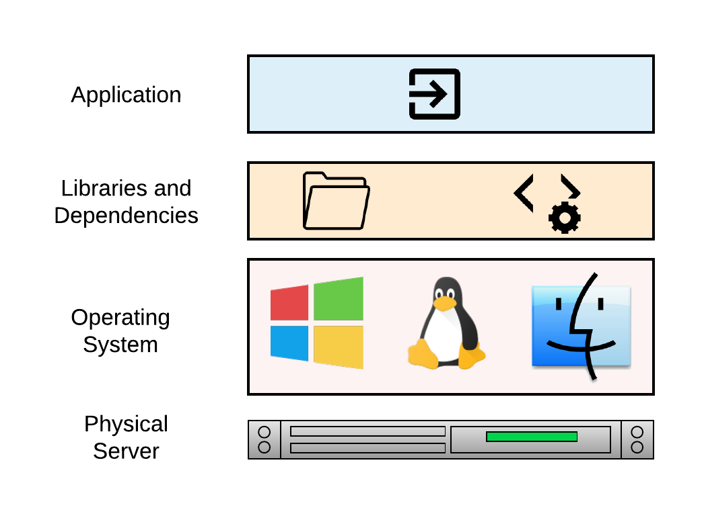
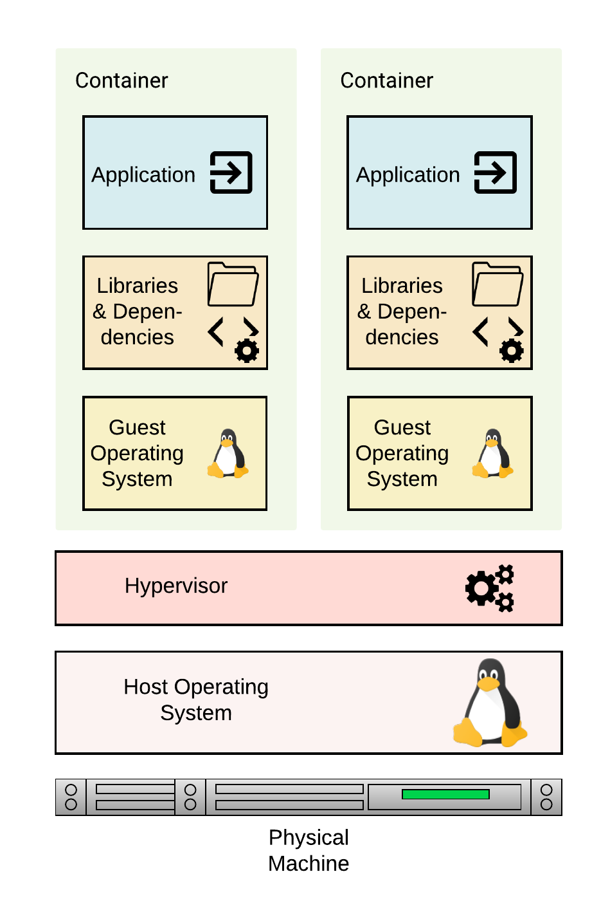
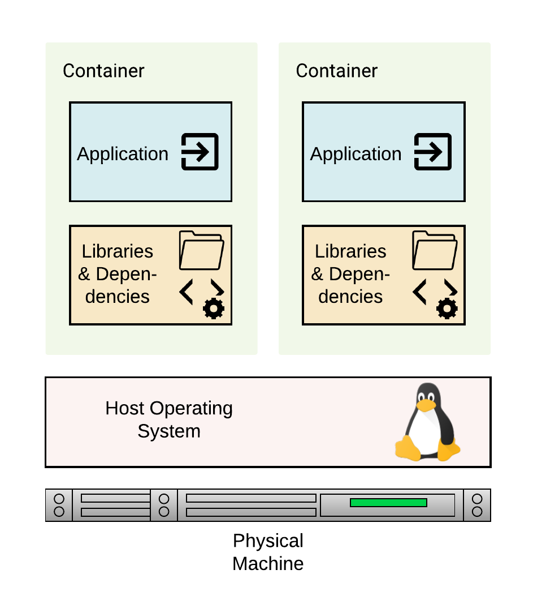
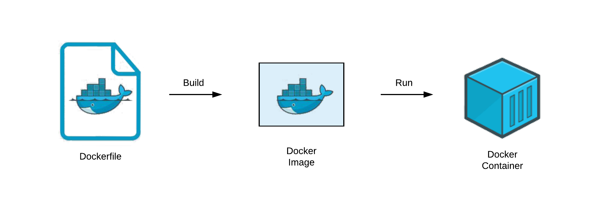

# Docker

Docker is a virtualization application that abstracts applications into isolated environments known as *containers*. The idea behind a container is to provide a unified platform that includes the software tools and dependencies for developing and deploying an application.

The traditional way of developing applications is where an application is designed and hosted on a single server. This setup results in a number of problems including the famous "it works on my machine but not on yours". Also in this architecture, apps are difficult to scale and to migrate resulting in huge costs and slow deployment.

## Virtual Machines vs. Containers
Virtual machines (VMs) emulates the capabilities of a physical machine making it possible to install and run operating systems by using a hypervisor. The hypervisor is a piece of software on the physical machine (the host) that makes it possible to carry out virtualization where multiple guest machines are managed by the host machine.

Containers on the other hand isolate the environment for hosting an application with its own libraries and software dependencies, however, as opposed to a VM, containers on a machine all share the same operating system kernel. Docker is an example of a container.

## Working with Docker
Begin by installing Docker software on the local machine to enable it run Docker containers. Visit <a href="https://www.docker.com/get-started">https://www.docker.com/get-started</a> to get started.

Key concepts to note are:
- **Dockerfile:** A Dockerfile is a text file that specifies how an image will be created.
- **Docker Images:** Images are created by building a Dockerfile.
- **Docker Containers:** Docker containers is the runnning instance of an image.

The diagram below highlights the process to build an image and run a Docker container.

## Writing a Dockerfile
The following are key routines when creating a Dockerfile.

|**Command**|**Description**|
|-|-|
|__FROM__| The base Docker image for the Dokerfile.
|__MAINTAINER__| The contact details of the Dockerfile maintainer.
|__RUN__| Commands to execute when building the container.
|__COPY__| Copies files from the local machine to the container filesystem.
|__EXPOSE__ | Exposes runtime ports for the Docker container.
|__CMD__ | Specifies the command to execute when running the container. This command is overridden if another command is specified at runtime.
|__ENTRYPOINT__ | Specifies the command to execute when running the container. Entrypoint commands are not overridden by a command specified at runtime.
|__WORKDIR__ | Set working directory of the container.
|__VOLUME__ | ABCD
|__ARG__ | ABCD
|__ENV__ | ABCD