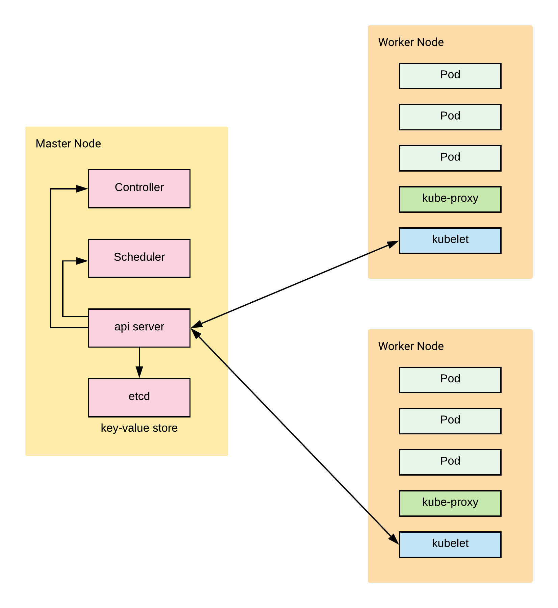
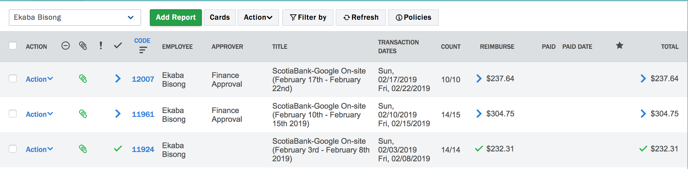

# Kubernetes (K8s)

Table of Contents:
- [Kubernetes (K8s)](#kubernetes-k8s)
  - [Features of Kubernetes](#features-of-kubernetes)
  - [Components of Kubernetes](#components-of-kubernetes)
    - [Master Node(s)](#master-nodes)
    - [Worker Node(s)](#worker-nodes)
  - [Writing a Kubernetes Deployment File](#writing-a-kubernetes-deployment-file)
    - [Example of a Service Object](#example-of-a-service-object)
    - [Example of a Deployment Object](#example-of-a-deployment-object)
  - [Deploying Kubernetes on Local Machine using Minikube](#deploying-kubernetes-on-local-machine-using-minikube)
    - [Overview of Minikube commands](#overview-of-minikube-commands)
    - [Overview of `kubectl` commands](#overview-of-kubectl-commands)
    - [Using `kubectl` to deploy and manage the Kubernetes cluster](#using-kubectl-to-deploy-and-manage-the-kubernetes-cluster)
    - [Running Webpage on pod orchestrated by Kubernetes](#running-webpage-on-pod-orchestrated-by-kubernetes)
  - [Deploying Kubernetes on Google Kubernetes Engine](#deploying-kubernetes-on-google-kubernetes-engine)

When a microservice application is deployed in production, it usually has many running containers that need to be allocated the right amount of resources in response to user demands. Also, there is a need to ensure that the containers are online, running and are communicating with one another. The need to efficiently manage and coordinate clusters of containerized applications gave rise to Kubernetes.

Kubernetes is a software system that addresses the concerns of deploying, scaling and monitoring containers. Hence, it is called a *container orchestrator*.  Examples of other container orchestrators in the wild are Docker Swarm, Mesos Marathon and Hashicorp Nomad.

Kubernetes was built and released by Google as an open-source software, which is now managed by the <a href="https://www.cncf.io/">Cloud Native Computing Foundation (CNCF)</a>. Google Cloud Platform offers a managed Kubernetes services called <a href="https://cloud.google.com/kubernetes-engine/">**Google Kubernetes Engine (GKE)**</a>. <a href="https://aws.amazon.com/kubernetes/">Amazon Elastic Container Service for Kubernetes (EKS)</a> also provides a  managed Kubernetes service.

## Features of Kubernetes
- **Horizontal auto-scaling:** dynamically scales containers based on resource demands.
- **Self-healing:** re-provisions failed nodes in response to health checks.
- **Load balancing:** efficiently distributes requests between containers in a pod.
- **Rollbacks and updates:** easily update or revert to a previous container deployment without causing application downtime.
-  **DNS service discovery:** Uses Domain Name System (DNS) to manage container groups as a Kubernetes service.

## Components of Kubernetes
The main components of the Kubernetes engine are the:
- **Master node(s)**: manages the Kubernetes cluster. They may be more than one master node in High Availability mode for fault-tolerance purposes. In this case, only one is the master, and the others follow.
- **Worker node(s)**: machine(s) that runs containerized applications that are scheduled as pod(s).

The illustration below provides a high overview of the Kubernetes architecture. Later, we'll briefly go through the individual sub-components.



### Master Node(s)
- **etcd (distributed key-store):** manages the Kubernetes cluster state. This distributed key-store can be a part of the Master node or external to it. Nevertheless, all master nodes connect to it.
- **api server:** manages all administrative tasks. The `api server` receives commands from the user (kubectl cli,REST or GUI), these commands are executed and the new cluster state is stored in the distributed key-store.
- **scheduler:** schedules work to worker nodes by allocating pods. It is responsible for resource allocation.
- **controller:** ensure that the desired state of the Kubernetes cluster is maintained. The desired state is what is contained in a JSON or YAML deployment file.

### Worker Node(s)
- **kubelet:** the `kubelet` agent runs on each worker node. It connects the worker node to the `api server` on the master node and received instructions from it. Ensures the pods on the node are healty.
- **kube-proxy:** it is the Kubernetes network proxy thats runs on each worker node. Listens to the `api server` and forward requests to the appropriate pod. Important for load-balancing.
- **pod(s):** consists of one or more containers that share network and storage resources as well as container runtime instructions. Pods are the smallest deployable unit in Kubernetes.

## Writing a Kubernetes Deployment File
The Kubernetes deployment file defines the desired state for the various Kubernetes objects. Examples of Kubernetes objects are:
- **Pods:** a collection of one or more containers.
- **ReplicaSets:** part of the `controller` in the master node. Specifies the number of replicas of a pod that should be running at any given time. It ensures that the specified number of pods is maintained in the cluster.
- **Deployments:** automatically creates `ReplicaSets`. It is also part of the `controller` in the master node. Ensures that the clusters current state matches the desired state.
- **Namespaces:** partition the cluster into sub-clusters to organize users into groups.
- **Service:** a logical group of Pods with a policy to access them.
  - *ServiceTypes:* specifies the type of Service e.g. `ClusterIP`, `NodePort`, `LoadBalancer`, `ExternalName`. As an example, `LoadBalancer` exposes the service externally using a cloud provider’s load balancer.

Other important tags in writing a Kubernetes Deployment File.
- **spec:** describes the desired state of the cluster.
- **metadata:** contains information of the object.
- **labels:** used to specify attributes of objects as key-value pairs.
- **selector:** used to select a subset of objects based on their label values.

The deployment file is specified as a `yaml` file.

The example in the next sections deploys the nginx server image that was pushed to Dockerhub in the <a href="./3_docker.md">previous section</a> to a Kubernetes cluster. The image is accessible at <a href="https://hub.docker.com/r/ekababisong/ebisong-nginx-server">https://hub.docker.com/r/ekababisong/ebisong-nginx-server</a>.

### Example of a Service Object
This code snippet of a `Service` object is saved in `kubernetes-intro/deployment.yaml`.
```yaml
kind: Service
apiVersion: v1
metadata:
  name: nginx-server-service
spec:
  # service applies to application with name `nginx-server`
  selector:
    app: nginx-server
  ports:
    - protocol: "TCP"
      # port inside cluster
      port: 8080
      # forward to port inside the pod
      targetPort: 80
      # accessible outside cluster
      nodePort: 30001
  # load balance between 5 instances of the container application
  type: LoadBalancer
```

### Example of a Deployment Object
This code snippet of a `Deployment` object is saved in `kubernetes-intro/deployment.yaml`.
```yaml
apiVersion: extensions/v1beta1
kind: Deployment
metadata:
  name: nginx-server-deployment
spec:
  replicas: 5
  template:
    metadata:
      labels:
        app: nginx-server
    spec:
      containers:
        - name: nginx-server
          image: ekababisong/ebisong-nginx-server
          ports:
            - containerPort: 80
```

## Deploying Kubernetes on Local Machine using Minikube
Minikube makes it easy to install and run a single-node Kubernetes cluster on a local machine. Go to <a href="https://kubernetes.io/docs/tasks/tools/install-minikube/">https://kubernetes.io/docs/tasks/tools/install-minikube/</a> for instructions on installing Minikube.

1. Install a hypervisor e.g. <a href="https://www.virtualbox.org/wiki/Downloads">VirtualBox</a>.
2. Install Kubernetes Command line interface `kubectl`.
For mac:
```bash
brew install kubernetes-cli
```
Check the installed version:
```bash
kubectl version
```
3. Install Minikube.
For mac:
```bash
brew cask install minikube
```

### Overview of Minikube commands
|**Command**|**Description**|
|-|-|
|`minikube status`| Check if Minikube is running.
|`minikube start`| Create local kubernetes cluster.
|`minikube dashboard`| Open Minikube GUI for interacting with the Kubernetes cluster. Append `&` to open in background mode `minikube dashboard &`.
|`minikube ip`| get ip address of Kubernetes cluster.


### Overview of `kubectl` commands
|**Command**|**Description**|
|-|-|
|`kubectl get all`| list all resources.
|`kubectl get pods`| list pods.
|`kubectl get deployments --all-namespaces`| list deployments for all namespaces.
|`kubectl create -f [DEPLOYMENT_FILE.yaml]`| create new resource based on desired state in the `yaml` file.
|`kubectl apply -f [DEPLOYMENT_FILE.yaml]`| if resource already exists, refresh the resource based on the `yaml` file.
|`kubectl apply -f [DEPLOYMENT_FILE.yaml]`| if resource already exists, refresh the resource based on the `yaml` file.
|`kubectl get nodes`| get the nodes of the Kubernetes cluster.
|`kubectl delete deployment [DEPLOYMENT_NAME]`| delete the deployment with `[DEPLOYMENT_NAME]`.
|`kubectl delete svc [SERVICE_NAME]`| delete the service with `[SERVICE_NAME]`.
|`kubectl delete pod [POD_NAME]`| delete the pod with `[POD_NAME]`.


### Using `kubectl` to deploy and manage the Kubernetes cluster

```bash
# create local kubernetes cluster
minikube start
```

```
Starting local Kubernetes v1.13.2 cluster...
Starting VM...

Getting VM IP address...
Moving files into cluster...
Setting up certs...
Connecting to cluster...
Setting up kubeconfig...
Stopping extra container runtimes...
Machine exists, restarting cluster components...
Verifying kubelet health ...
Verifying apiserver health ....
Kubectl is now configured to use the cluster.
Loading cached images from config file.

Everything looks great. Please enjoy minikube!
```

```bash
# navigate to directory with deployment file
cd kubernetes-intro/

# create new resource from yaml file
kubectl create -f deployment.yaml
```

```
service "nginx-server-service" created
deployment.extensions "nginx-server-deployment" created
```

```bash
# launch minikube dashboard
minikube dashboard
```

```
Verifying dashboard health ...
Launching proxy ...
Verifying proxy health ...
Opening http://127.0.0.1:54356/api/v1/namespaces/kube-system/services/http:kubernetes-dashboard:/proxy/ in your default browser...
```



```bash
# list pods
kubectl get pods
```

```
NAME                                      READY     STATUS    RESTARTS   AGE
nginx-server-deployment-f878d8679-5ptlc   1/1       Running   0          10m
nginx-server-deployment-f878d8679-6gk26   1/1       Running   0          10m
nginx-server-deployment-f878d8679-9hdhh   1/1       Running   0          10m
nginx-server-deployment-f878d8679-pfm27   1/1       Running   0          10m
nginx-server-deployment-f878d8679-rnmhw   1/1       Running   0          10m
```

```bash
# get ip address of kubernetes cluster
$ minikube ip
```

```
192.168.99.102
```

### Running Webpage on pod orchestrated by Kubernetes
Let's access the application inside the Kubernetes cluster by running <a href="http://192.168.99.102:30001">192.168.99.102:30001</a>. We use the port `30001` because we are accessing the application from outside the cluster.


## Deploying Kubernetes on Google Kubernetes Engine
ABCD