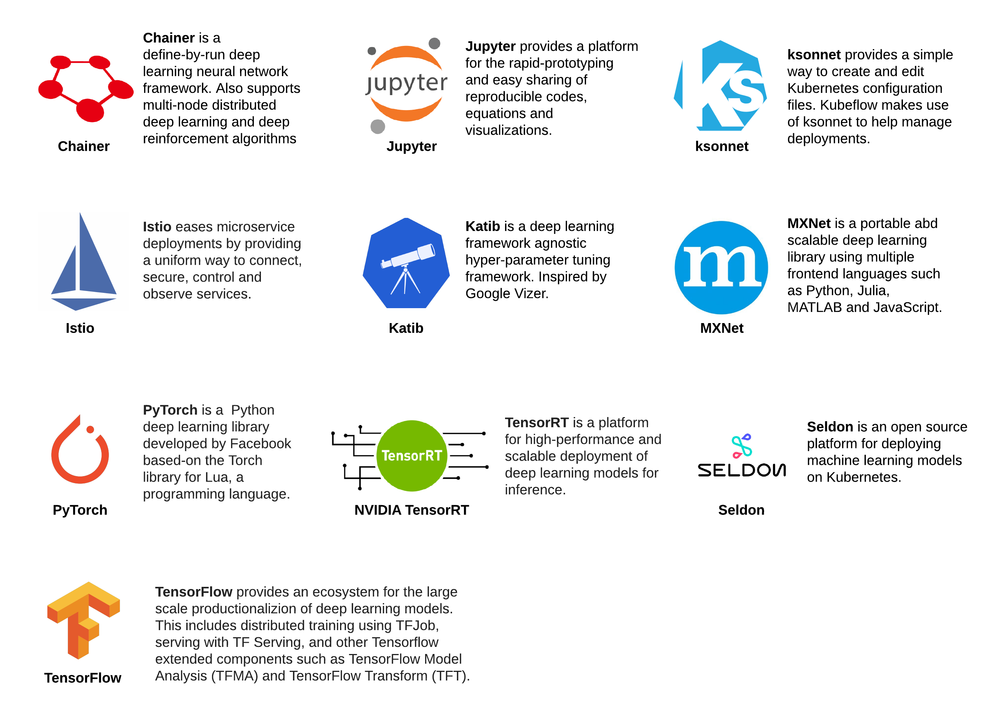
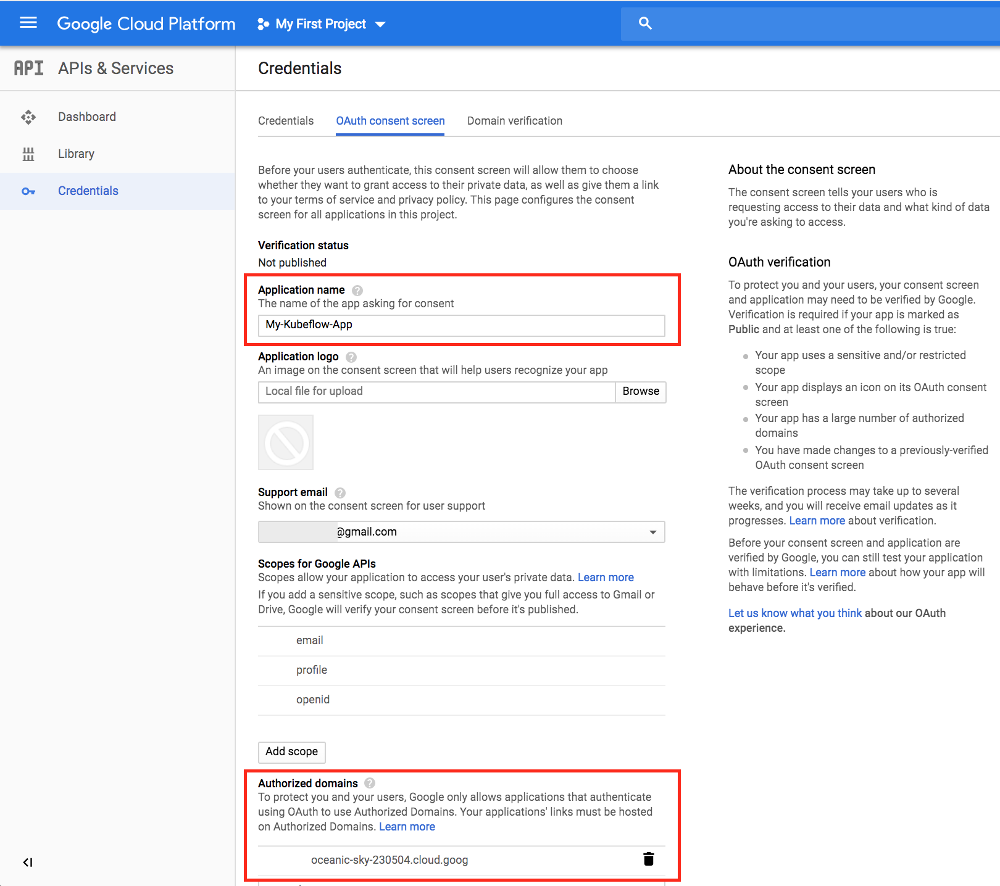
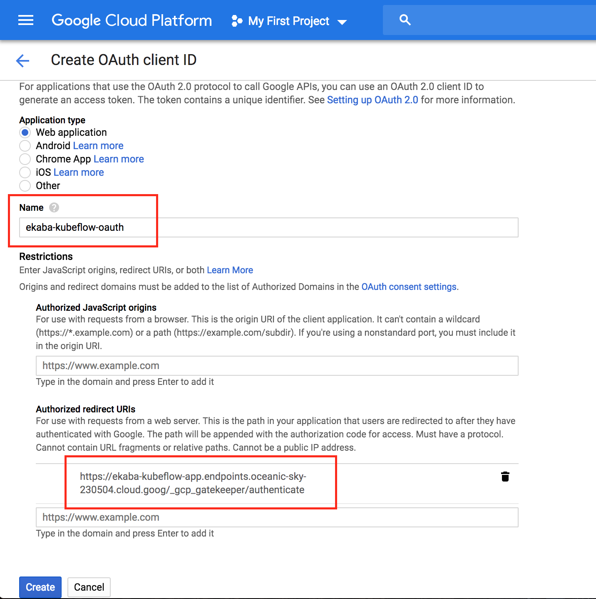
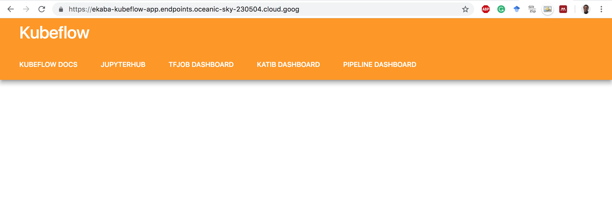

# Kubeflow

Table of Contents:
<!-- - [Kubeflow](#kubeflow) -->
  - [Working with Kubeflow](#working-with-kubeflow)
    - [Set-up a Kubernetes cluster on GKE](#set-up-a-kubernetes-cluster-on-gke)
    - [Create OAuth client ID to identify Cloud IAP](#create-oauth-client-id-to-identify-cloud-iap)
    - [Download kfctl.sh](#download-kfctlsh)
    - [Deploy Kubeflow](#deploy-kubeflow)
  - [Delete Resources](#delete-resources)
    - [Remove Kubeflow](#remove-kubeflow)
    - [Remove the Kubernetes Cluster](#remove-the-kubernetes-cluster)

Kubeflow is a platform that is created to enhance and simplify the process of deploying machine learning workflows on Kubernetes. Using Kubeflow, it becomes easier to manage a distributed machine learning deployment by placing components in the deployment pipeline such as the training, serving, monitoring and logging components into containers on the Kubernetes cluster.

The goal of Kubeflow is to abstract away the technicalities of managing a Kubernetes cluster so that a machine learning practitioner can quickly leverage the power of Kubernetes and the benefits of deploying products within a microservices framework. Kubeflow has its history as an internal Google framework for implementing machine learning pipelines on Kubernetes before being open-sourced late 2017.

## Working with Kubeflow
Kubeflow consists of some core components:



### Set-up a Kubernetes cluster on GKE
```bash
# create a GKE cluster
gcloud container clusters create ekaba-gke-cluster
```

```
Creating cluster ekaba-gke-cluster in us-central1-a... Cluster is being health-checked (master is healthy)...done.
Created [https://container.googleapis.com/v1/projects/oceanic-sky-230504/zones/us-central1-a/clusters/ekaba-gke-cluster].
To inspect the contents of your cluster, go to: https://console.cloud.google.com/kubernetes/workload_/gcloud/us-central1-a/ekaba-gke-cluster?project=oceanic-sky-230504
kubeconfig entry generated for ekaba-gke-cluster.
NAME               LOCATION       MASTER_VERSION  MASTER_IP      MACHINE_TYPE   NODE_VERSION  NUM_NODES  STATUS
ekaba-gke-cluster  us-central1-a  1.11.7-gke.4    35.193.101.24  n1-standard-1  1.11.7-gke.4  3          RUNNING
```

```bash
# view the nodes of the kubernetes cluster on GKE
kubectl get nodes
```

```
NAME                                               STATUS    ROLES     AGE       VERSION
gke-ekaba-gke-cluster-default-pool-0f55a72b-0707   Ready     <none>    4m        v1.11.7-gke.4
gke-ekaba-gke-cluster-default-pool-0f55a72b-b0xv   Ready     <none>    4m        v1.11.7-gke.4
gke-ekaba-gke-cluster-default-pool-0f55a72b-g4w8   Ready     <none>    4m        v1.11.7-gke.4
```

### Create OAuth client ID to identify Cloud IAP
Kubeflow uses Cloud Identity-Aware Proxy (Cloud IAP) to connect to Jupyter and other running web apps securely. Kubeflow uses email addresses for authentication. In this section, we'll create an OAuth client ID which will be used to identify Cloud IAP when requesting access to a user’s email account.

- Go to the <a href="https://console.cloud.google.com/apis/credentials">APIs & Services -> Credentials</a> page in GCP Console.
- Go to the OAuth consent screen.
  - Assign an Application Name, e.g. My-Kubeflow-App
  - For Authorized domains, use [YOUR_PRODJECT_ID].cloud.goog



- Go to the Credentials tab.
  - Click Create credentials, and then click OAuth client ID.
  - Under Application type, select Web application.


  - Choose a **Name** to identify the OAuth client ID.
  - In the Authorized redirect URIs box, enter the following:
    ```
    https://<deployment_name>.endpoints.<project>.cloud.goog/_gcp_gatekeeper/authenticate
    ```
  - <deployment_name> must be the name of the Kubeflow deployment.
  - <project> is the GCP project ID.
  - In this case, it will be:
  ```
  https://ekaba-kubeflow-app.endpoints.oceanic-sky-230504.cloud.goog/_gcp_gatekeeper/authenticate
  ```

  

- Take note of the client ID and client secret that appear in the OAuth client window. This is needed to enable Cloud IAP.

```bash
# Create environment variables from the OAuth client ID and secret earlier obtained.
export CLIENT_ID=506126439013-drbrj036hihvdolgki6lflovm4bjb6c1.apps.googleusercontent.com
export CLIENT_SECRET=bACWJuojIVm7PIMphzTOYz9D
export PROJECT=oceanic-sky-230504
```

### Download kfctl.sh
```bash
# create a folder on the local machine
mkdir kubeflow

# move to created folder
cd kubeflow

# save folder path as a variable
export KUBEFLOW_SRC=$(pwd)

# download kubeflow `kfctl.sh`
export KUBEFLOW_TAG=v0.4.1

curl https://raw.githubusercontent.com/kubeflow/kubeflow/${KUBEFLOW_TAG}/scripts/download.sh | bash
```

```
  % Total    % Received % Xferd  Average Speed   Time    Time     Time  Current
                                 Dload  Upload   Total   Spent    Left  Speed
100   800  100   800    0     0   1716      0 --:--:-- --:--:-- --:--:--  1716
+ '[' '!' -z 0.4.1 ']'
+ KUBEFLOW_TAG=v0.4.1
+ KUBEFLOW_TAG=v0.4.1
++ mktemp -d /tmp/tmp.kubeflow-repo-XXXX
+ TMPDIR=/tmp/tmp.kubeflow-repo-MJcy
+ curl -L -o /tmp/tmp.kubeflow-repo-MJcy/kubeflow.tar.gz https://github.com/kubeflow/kubeflow/archive/v0.4.1.tar.gz
  % Total    % Received % Xferd  Average Speed   Time    Time     Time  Current
                                 Dload  Upload   Total   Spent    Left  Speed
100   125    0   125    0     0     64      0 --:--:--  0:00:01 --:--:--    64
100 8099k    0 8099k    0     0  1309k      0 --:--:--  0:00:06 --:--:-- 2277k
+ tar -xzvf /tmp/tmp.kubeflow-repo-MJcy/kubeflow.tar.gz -C /tmp/tmp.kubeflow-repo-MJcy
...
x kubeflow-0.4.1/tf-controller-examples/tf-cnn/README.md
x kubeflow-0.4.1/tf-controller-examples/tf-cnn/create_job_specs.py
x kubeflow-0.4.1/tf-controller-examples/tf-cnn/launcher.py
++ find /tmp/tmp.kubeflow-repo-MJcy -maxdepth 1 -type d -name 'kubeflow*'
+ KUBEFLOW_SOURCE=/tmp/tmp.kubeflow-repo-MJcy/kubeflow-0.4.1
+ cp -r /tmp/tmp.kubeflow-repo-MJcy/kubeflow-0.4.1/kubeflow ./
+ cp -r /tmp/tmp.kubeflow-repo-MJcy/kubeflow-0.4.1/scripts ./
+ cp -r /tmp/tmp.kubeflow-repo-MJcy/kubeflow-0.4.1/deployment ./
```

```bash
# list directory elements
ls -la
```

```
drwxr-xr-x   6 ekababisong  staff   204 17 Mar 04:15 .
drwxr-xr-x  25 ekababisong  staff   850 17 Mar 04:09 ..
drwxr-xr-x   4 ekababisong  staff   136 17 Mar 04:18 deployment
drwxr-xr-x  36 ekababisong  staff  1224 17 Mar 04:14 kubeflow
drwxr-xr-x  16 ekababisong  staff   544 17 Mar 04:14 scripts
```

### Deploy Kubeflow
```bash
# assign the name for the Kubeflow deployment
# The ksonnet app is created in the directory ${KFAPP}/ks_app
export KFAPP=ekaba-kubeflow-app

# run setup script
${KUBEFLOW_SRC}/scripts/kfctl.sh init ${KFAPP} --platform gcp --project ${PROJECT}

# navigate to the deployment directory
cd ${KFAPP}

# creates config files defining the various resources running on kubernetes
${KUBEFLOW_SRC}/scripts/kfctl.sh generate platform
${KUBEFLOW_SRC}/scripts/kfctl.sh apply platform
${KUBEFLOW_SRC}/scripts/kfctl.sh generate k8s
${KUBEFLOW_SRC}/scripts/kfctl.sh apply k8s
```

```bash
# view resources deployed in namespace kubeflow
kubectl -n kubeflow get  all
```

Kubeflow is available at the url: https://ekaba-kubeflow-app.endpoints.oceanic-sky-230504.cloud.goog/
**Note:** It can take 10-15 minutes for the URI to become available. Kubeflow needs to provision a signed SSL certificate and register a DNS name.

**The Kubeflow Homescreen**



## Delete Resources

See the end of <a href="./6_kubeflow_pipelines.md">Kubeflow Pipelines</a> to delete billable GCP resources.