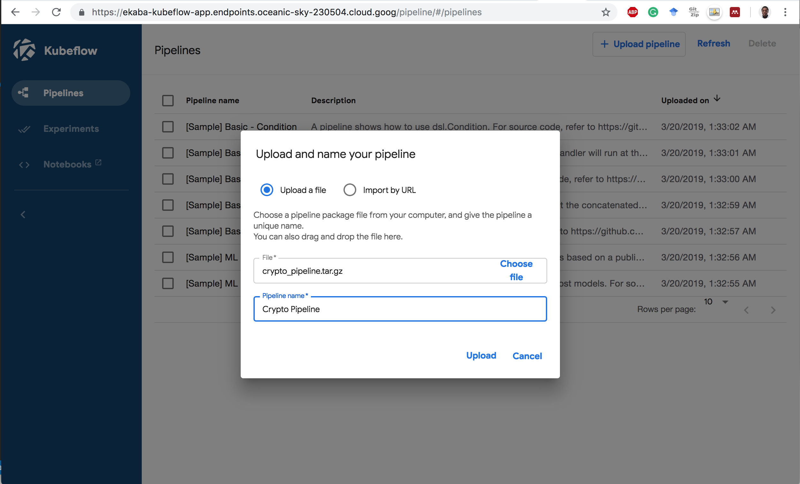
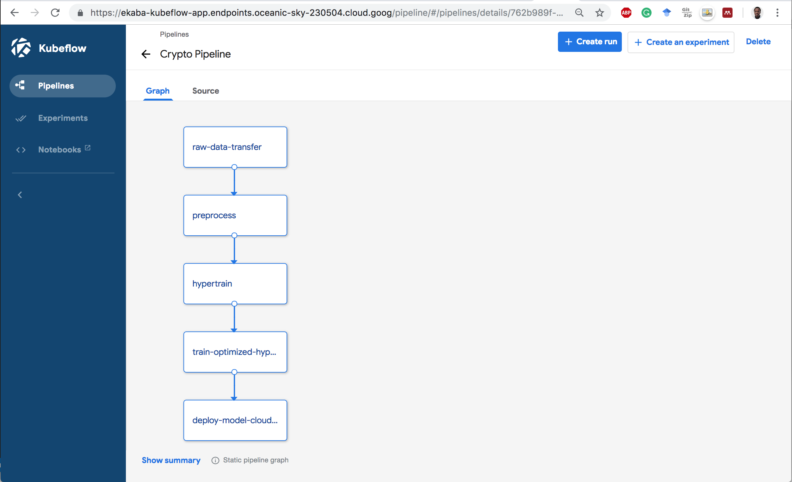
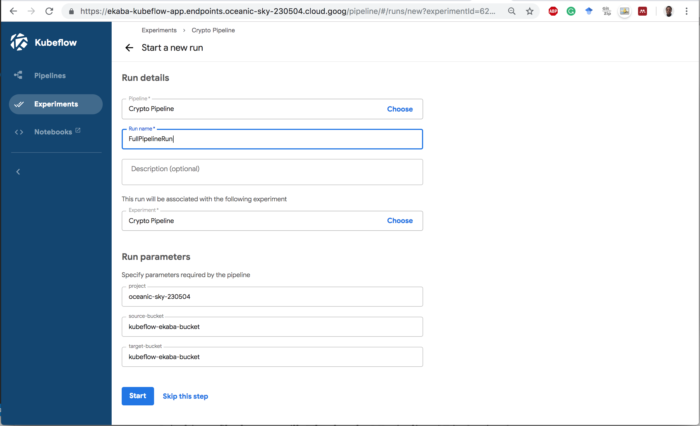
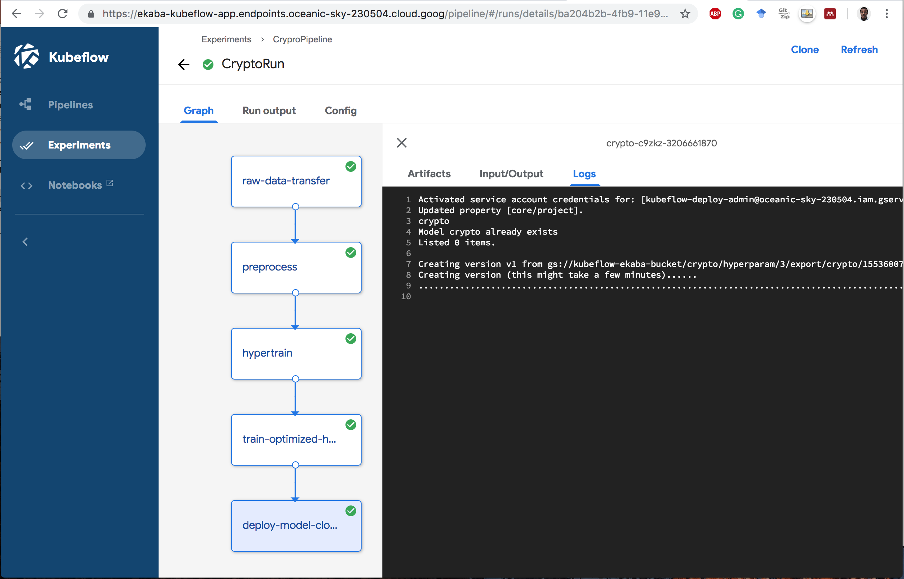

# Deploying an End-to-End Machine Learning Solution on Kubeflow Pipelines

Table of Contents:
- [Deploying an End-to-End Machine Learning Solution on Kubeflow Pipelines](#deploying-an-end-to-end-machine-learning-solution-on-kubeflow-pipelines)
  - [Overview of a simple end-to-end solution pipeline](#overview-of-a-simple-end-to-end-solution-pipeline)
  - [Create a container image for each component](#create-a-container-image-for-each-component)
  - [Build containers before upload to Kubeflow Pipelines](#build-containers-before-upload-to-kubeflow-pipelines)
  - [Compile the Pipeline using the Kubeflow Pipelines DSL language](#compile-the-pipeline-using-the-kubeflow-pipelines-dsl-language)
  - [Upload and execute the Pipeline to Kubeflow Pipelines](#upload-and-execute-the-pipeline-to-kubeflow-pipelines)
  - [Delete Resources](#delete-resources)
    - [Delete Kubeflow](#delete-kubeflow)
    - [Delete the Kubernetes Cluster](#delete-the-kubernetes-cluster)

A Kubeflow pipeline component is an implementation of a pipeline task. A component is a step in the workflow. Each task takes one or more artifacts as input and may produce one or more artifacts as output.

Each component usually includes two parts:
- Client code: The code that talks to endpoints to submit jobs. For example, code to talk to the Google Cloud Machine Learning Engine.
- Runtime code: The code that does the actual job and usually runs in the cluster. For example, the code that prepares the model for training on Cloud MLE.

A component consists of an interface (inputs/outputs), the implementation (a Docker container image and command-line arguments) and metadata (name, description).

## Overview of a simple end-to-end solution pipeline
In this simple example, we will implement a deep neural regressor network to predict the closing prices of bitcoin crypto currency. The machine learning code itself is pretty basic as it is not the focus of this article. The goal here is to orchestrate a machine learning engineering solution using microservice architectures on Kubernetes with Kubeflow Pipelines.

The pipeline consists of the following components:
1). Move raw data hosted on Github to a storage bucket.
2). Transform the dataset using Google Dataflow.
3). Carry-out hyper-parameter training on Cloud Machine Learning Engine.
4). Train the model with the optimized hyper-parameters.
5). Deploy the model for serving on Cloud MLE.

## Create a container image for each component
First, we'll package the client and runtime code into a Docker image. This image also contains the secure service account key to authenticate against GCP. For example, the component to transform the dataset using Dataflow has the following files built into ints image:
```bash
|__ `DataflowTransform`
|______ `Dockerfile` : Dockerfile to build the Docker image.
|______ `build.sh` : Script to initiate the container build and upload to Google Container Registry.
|______ `dataflow_transform.py` : Code to run the beam pipeline on Cloud Dataflow.
|______ `service_account.json` : Secure key to authenticate container on GCP.
|______ `local_test.sh` : Script to run the image pipeline component locally.
```

## Build containers before upload to Kubeflow Pipelines
Before uploading the pipeline to Kubeflow Pipelines, be sure to build the component containers so that the latest version of the code are packaged and uploaded as images to the container registry. The code provides a handy `bash` script to build all containers.

## Compile the Pipeline using the Kubeflow Pipelines DSL language
The pipeline code contains a specification on how the components interact with one another. Each component has an output that serves as an input to the next component in the pipeline. The Kubeflow pipeline DSL language `dsl-compile` from the Kubeflow Pipelines SDK is used to compile the pipeline code in Python for upload to Kubeflow Pipelines.

Ensure the Kubeflow Pipelines SDK is installed on the local machine by runnng:
```bash
# install kubeflow pipeline sdk
pip install https://storage.googleapis.com/ml-pipeline/release/0.1.12/kfp.tar.gz --upgrade

# verify the install
which dsl-compile
```

Compile the pipeline by running:
```bash
# compile the pipeline
python3 [path/to/python/file.py] [path/to/output/tar.gz]
```

For the sample code, we used:
```bash
python3 crypto_pipeline.py crypto_pipeline.tar.gz
```

## Upload and execute the Pipeline to Kubeflow Pipelines
1. Upload the pipeline to Kubeflow Pipelines.



2. Click on pipeline to see static graph of flow.



3. Create an `Experiment` and `Run` to execute the pipeline.



4. Completed Pipeline Run.




## Delete Resources

### Delete Kubeflow
```bash
# navigate to kubeflow app
cd ${KFAPP}

# run script to delete the deployment
${KUBEFLOW_SRC}/scripts/kfctl.sh delete all
```

### Delete the Kubernetes Cluster
```bash
# delete the kubernetes cluster
gcloud container clusters delete ekaba-gke-cluster
```