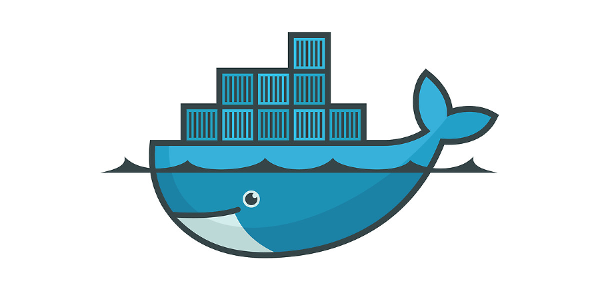

# Kubeflow for Poets: A Guide to Containerization of the Machine Learning Production Pipeline

    &nbsp;&nbsp;&nbsp;&nbsp;&nbsp;&nbsp;&nbsp;&nbsp;
    &nbsp;&nbsp;&nbsp;&nbsp;&nbsp;&nbsp;&nbsp;&nbsp;
    &nbsp;&nbsp;&nbsp;&nbsp;&nbsp;&nbsp;&nbsp;&nbsp;
    

 

This repository provides a systematic approach to productionalizing machine learning pipelines with Kubeflow on Kubernetes. Building machine learning models is just one piece of a more extensive system of tasks and processes that come together to deliver a Machine Learning product. Kubeflow makes it possible to leverage the microservices paradigm of containerization to separate modular components of an application orchestrated on Kubernetes. While Kubernetes is platform agnostic, this tutorial will focus on deploying a Machine Learning product on Google Cloud Platform leveraging Google Cloud BigQuery, Google Cloud Dataflow and Google Cloud Machine Learning Engine orchestrated on Google Kubernetes Engine.

## Contents:
The content is arranged as follows:
- <a href="./1_introduction.md">Introduction</a>
- <a href="./2_microservices.md">Microservices Architecture</a>
- <a href="./3_docker.md">Docker</a>
- <a href="./4_kubernetes.md">Kubernetes</a>
- <a href="./5_kubeflow.md">Kubeflow</a>
- <a href="./6_kubeflow_pipelines.md">Kubeflow Pipelines</a>
- <a href="./7_end_to_end_kubeflow_pipelines.md">Deploying an End-to-End Machine Learning Solution on Kubeflow Pipelines</a>

## Links:
 - <a href="https://www.docker.com/">Docker</a>
 - <a href="https://kubernetes.io/">Kubernetes</a>
 - <a href="https://github.com/kubeflow/kubeflow">Kubeflow</a>
 - <a href="https://github.com/kubeflow/pipelines">Kubeflow Pipelines</a>
 - <a href="https://cloud.google.com/bigquery/">Google Cloud BigQuery</a>
 - <a href="https://cloud.google.com/dataflow/">Google Cloud Dataflow</a>
 - <a href="https://cloud.google.com/ml-engine/">Google Cloud Machine Learning Engine</a>
 - <a href="https://cloud.google.com/kubernetes-engine/">Google Kubernetes Engine</a>

## Contribution:
Contributions and corrections are welcomed as pull requests.